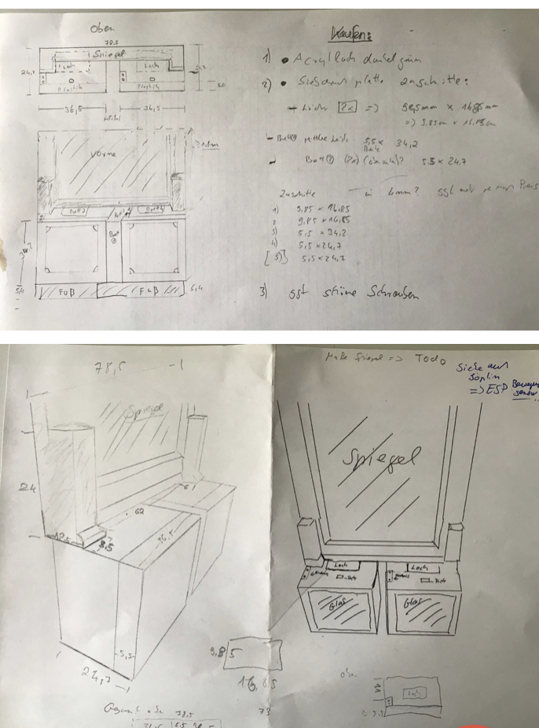
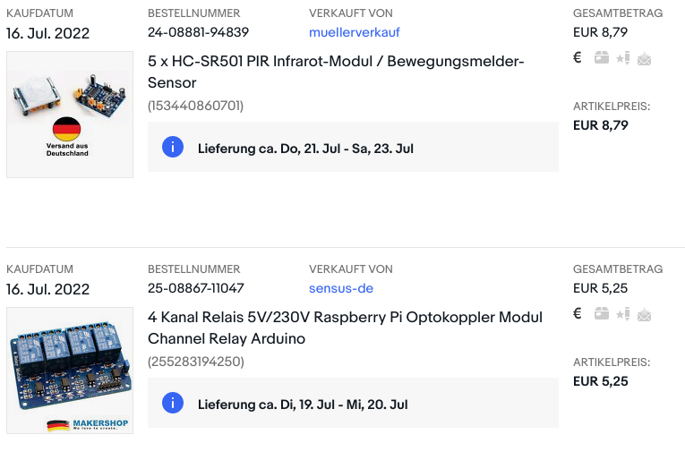

# spiegel_schrank

README still in progress... !!!

## Project Structur:

## Zeichnung Projekt

## HARDWARE WIRING to esp-nodemcu:
|     |     |     |     |
| --- | --- | --- | --- |
|   pin  | todo  | module  | todo  |

## shopping list

### Movement Sensors

- here you see how to connect the movement sensors with the ESP

| ESPNodeMCU | Sensors |
| --- | --- |
| Pin 1 (3.3V) | Pin 16 (VDD) TODO |
| Pin 1 (3.3V) | Pin 15 (VREF) TDOD |
| Pin 6 (GND) | Pin 14 (AGND) TODO |

