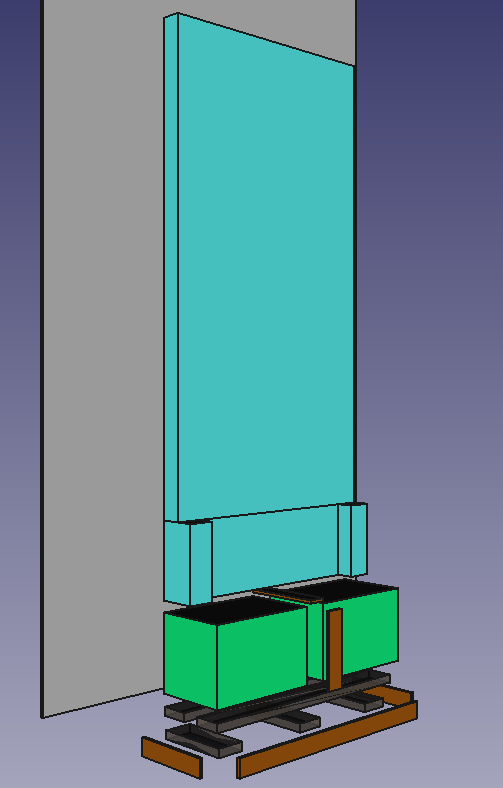

# spiegel_schrank

README still in progress... !!!

## What you can find here ?
- acutally not that much complicated or worth sharing, just a fun project...  ;-)
- just my litte project
- there will be some cpp code for the esp (4 Channel - Relais, Movement Sensors)
- maybe some MQTT or http for remote control
- Documentation and some pictures 
    - wiring  ...
    - shopping list

 

## Vorwort zum Projekt [German]
> Das SpiegelSchrank Projekt nimmt seinen Anfang mit dem Finden von zwei super erhaltenen OverHeadProjektoren 
im MüllContainer einer naheliegenden Schule... 
> 
> Die Idee war für einen sehr alten, wunderschönen Spiegel einen Unterschrank aus den OHPs zu bauen.
> Treu dem Motto, ein bisschen smart schadet nicht, sollen neben der Konstruktion des Schrankes auch gleich noch
> ein Mikrokontroller mitverbaut werden, ein paar Lampen und Bewegungssensoren. 
> Das tolle ist die OHPs bieten schon eine ordentliche Verkabelung und solide Kippschalter.
> 
>**Aktoren**
> Es sollen 2 Leuchten hinter die Glasscheiben, sowie ggf noch 2 LED Strahler den Spiegel von unten anstrahlen.
> Geschaltet werden diese vom ESP-NodeMCU mittels eines 4-Kanal Relais.
> 
> 
> **Sensoren**
> Aktuelle Idee ist in der Sockelleiste mittig sowie an den Seitenteilen die Bewegungssensoren zu platzieren.
> So kann der Schrank zum einen Licht einschalten wenn man davor steht / vorbei läuft und durch die 3 Sensoren
> sollte es zusätzlich möglich sein, das sich (bei einer Person in der Wohnung) die Position in welchem Raum 
> (der Bewohner/ich) sich befindet bestimmt werden kann
>> Mein Smarthomesytem sollte dies eh schon können, es lässt sich ja die Position innerhalb der Wohnung auch durch
>> andere Parameter bestimmten (hauptsächlich das Drücken von Tastern die festinstalliert sind), jedoch fehlt noch
>> eine sekunden genaue Bestimmung für den Raumwechsel.. Hier durch würde man das automatische Schalten vom Licht beim Durchgang durch die Wohnung
>> realiseren können. Oder auch das "Folgen" der Musikwiedergabe beim Raumwechsel. 
 

## Project idea:

*FreeCAD-Skizze für die Unterkonstruktion*

---

*Projektidee auf Papier*

## HARDWARE WIRING to esp-nodemcu:

- here you see how to connect the movement sensors with the ESP
    - TODO
- here you see how to connect the relais  with the ESP
    - TODO    

| ESPNodeMCU | Sensors |
| --- | --- |
|   todo    | todo  |
| Pin 1 (3.3V) | Pin 16 (VDD) TODO |
| Pin 6 (GND) | Pin 14 (GND) TODO |

## shopping list

